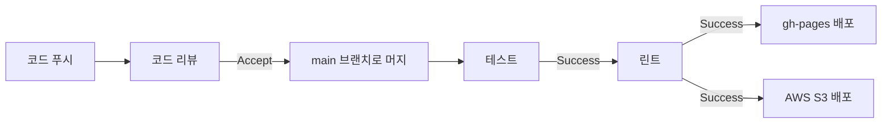

# 기업 분석 마이크로 프론트엔드

> Single-Spa Application 구성

## 🚩 목차

- [🛠️ 기술 스택](#%EF%B8%8F-기술-스택)
- [💁 소개](#-소개)
- [💡 주요 기능](#-주요-기능)
- [🎨 스크린샷](#-스크린샷)
- [📊 다이어그램](#-다이어그램)
  - [🧩 컴포넌트 구성](#-컴포넌트-구성)
  - [🔄 CI/CD 파이프라인](#-cicd-파이프라인)
- [📂 폴더 구조](#-폴더-구조)
- [🚀 실행 방법](#-실행-방법)

## 🛠️ 기술 스택

[](https://vuejs.org/)  
[](https://pinia.vuejs.org/)
[![Vue-Query](https://img.shields.io/badge/Vue_Query-FF4955.svg?logo=data:image/svg+xml;base64,PHN2ZyB4bWxucz0iaHR0cDovL3d3dy53My5vcmcvMjAwMC9zdmciIHdpZHRoPSIyMTQiIGhlaWdodD0iMjE0IiBzdHlsZT0ic2hhcGUtcmVuZGVyaW5nOmdlb21ldHJpY1ByZWNpc2lvbjt0ZXh0LXJlbmRlcmluZzpnZW9tZXRyaWNQcmVjaXNpb247aW1hZ2UtcmVuZGVyaW5nOm9wdGltaXplUXVhbGl0eTtmaWxsLXJ1bGU6ZXZlbm9kZDtjbGlwLXJ1bGU6ZXZlbm9kZCI+PHBhdGggc3R5bGU9Im9wYWNpdHk6Ljk1MyIgZmlsbD0iIzA3MmM0YiIgZD0iTS0uNSAxMy41YzI4LjY2OS0uMTY3IDU3LjMzNSAwIDg2IC41QTE3ODMuODk0IDE3ODMuODk0IDAgMCAxIDEwNiA0OC41IDU5NS4yNDUgNTk1LjI0NSAwIDAgMCAxMjYuNSAxNGMyOC45OTgtLjUgNTcuOTk4LS42NjcgODctLjV2MmEyNDQ4MS4xNTQgMjQ0ODEuMTU0IDAgMCAwLTEwNy41IDE4NEE4NzAxNzguMDU4IDg3MDE3OC4wNTggMCAwIDAtLjUgMTYuNXYtM3oiLz48cGF0aCBzdHlsZT0ib3BhY2l0eToxIiBmaWxsPSIjNjYzNDRlIiBkPSJNMTMyLjUgMjQuNWMyMC44MzctMS4zMjggNDEuODM3LTEuMzI4IDYzIDAtLjEyNC42MDctLjQ1Ny45NC0xIDFhOTYxLjYzNiA5NjEuNjM2IDAgMCAwLTYyLTF6Ii8+PHBhdGggc3R5bGU9Im9wYWNpdHk6MSIgZmlsbD0iI2ZiNDA1MyIgZD0iTTEzMi41IDI0LjVjMjAuODQtLjMzIDQxLjUwNy4wMDMgNjIgMWEyMDYxMy4yNzIgMjA2MTMuMjcyIDAgMCAxLTg4LjUgMTUzbC04OC41LTE1M2E2NDEuMjIzIDY0MS4yMjMgMCAwIDEgNjItLjVBMjk3MS40OTEgMjk3MS40OTEgMCAwIDEgMTA2IDY5LjVhNzYxLjI5IDc2MS4yOSAwIDAgMCAyNi41LTQ1eiIvPjxwYXRoIHN0eWxlPSJvcGFjaXR5OjEiIGZpbGw9IiMwYjJkNGIiIGQ9Ik0zOC41IDM3LjVjMTEuMTYtMS4xNiAyMi40OTItMS4zMjYgMzQtLjVBNDkxMC4wNiA0OTEwLjA2IDAgMCAwIDEwNiA5NC41bDMzLjUtNTdhMTQ1LjAwNCAxNDUuMDA0IDAgMCAxIDM0IDAgMTAwMDAuNTY0IDEwMDAwLjU2NCAwIDAgMS02Ny41IDExNiA5NzExLjM1NiA5NzExLjM1NiAwIDAgMC02Ny41LTExNnoiLz48cGF0aCBzdHlsZT0ib3BhY2l0eToxIiBmaWxsPSIjZjZkMzRjIiBkPSJNNTYuNSA0Ni41YzMuNjA2LS4yOSA3LjEwNi4wNDQgMTAuNSAxYTMzMzIuMTgzIDMzMzIuMTgzIDAgMCAwIDM5IDY3IDMzMzYuMDE5IDMzMzYuMDE5IDAgMCAwIDM5LTY3YzMuNzQ0LTEuMTI2IDcuNTc3LTEuMjkzIDExLjUtLjVMMTA2IDEzMy41YTI4MTAuOTcgMjgxMC45NyAwIDAgMS00OS41LTg3eiIvPjwvc3ZnPg==&style=flat-square)](https://tanstack.com/query/latest/docs/framework/vue/overview)
[](https://vee-validate.logaretm.com/v4/)  
[](https://quasar.dev/)
[](https://editorjs.io/)
[](https://zod.dev/)  
[](https://single-spa.js.org/)
[](https://ko.vite.dev)
[](https://www.typescriptlang.org/)  
[![Steiger](https://img.shields.io/badge/FSD_Steiger-211b1d.svg?logo=data:image/svg+xml;base64,PD94bWwgdmVyc2lvbj0iMS4wIiBlbmNvZGluZz0iVVRGLTgiPz4KPHN2ZyB2ZXJzaW9uPSIxLjEiIHhtbG5zPSJodHRwOi8vd3d3LnczLm9yZy8yMDAwL3N2ZyIgd2lkdGg9IjIwMCIgaGVpZ2h0PSIyMDAiPgo8cGF0aCBkPSJNMCAwIEMyOC4zOCAwIDU2Ljc2IDAgODYgMCBDODYgMy42MyA4NiA3LjI2IDg2IDExIEM1Ny42MiAxMSAyOS4yNCAxMSAwIDExIEMwIDcuMzcgMCAzLjc0IDAgMCBaICIgZmlsbD0iI0VCRUFFQSIgdHJhbnNmb3JtPSJ0cmFuc2xhdGUoNTcsMTAyKSIvPgo8cGF0aCBkPSJNMCAwIEMyOC4zOCAwIDU2Ljc2IDAgODYgMCBDODYgMy42MyA4NiA3LjI2IDg2IDExIEM1Ny42MiAxMSAyOS4yNCAxMSAwIDExIEMwIDcuMzcgMCAzLjc0IDAgMCBaICIgZmlsbD0iI0VCRUFFQSIgdHJhbnNmb3JtPSJ0cmFuc2xhdGUoNTcsODcpIi8+CjxwYXRoIGQ9Ik0wIDAgQzI4LjM4IDAgNTYuNzYgMCA4NiAwIEM4NiAzLjYzIDg2IDcuMjYgODYgMTEgQzU3LjYyIDExIDI5LjI0IDExIDAgMTEgQzAgNy4zNyAwIDMuNzQgMCAwIFogIiBmaWxsPSIjRUJFQUVBIiB0cmFuc2Zvcm09InRyYW5zbGF0ZSg1Nyw1NykiLz4KPHBhdGggZD0iTTAgMCBDMjguMzggMCA1Ni43NiAwIDg2IDAgQzg2IDMuNjMgODYgNy4yNiA4NiAxMSBDNTcuNjIgMTEgMjkuMjQgMTEgMCAxMSBDMCA3LjM3IDAgMy43NCAwIDAgWiAiIGZpbGw9IiNFQkVBRUEiIHRyYW5zZm9ybT0idHJhbnNsYXRlKDU3LDQyKSIvPgo8cGF0aCBkPSJNMCAwIEMxMy41MyAwIDI3LjA2IDAgNDEgMCBDNDEgMy42MyA0MSA3LjI2IDQxIDExIEMyNy40NyAxMSAxMy45NCAxMSAwIDExIEMwIDcuMzcgMCAzLjc0IDAgMCBaICIgZmlsbD0iI0U5RThFOCIgdHJhbnNmb3JtPSJ0cmFuc2xhdGUoNTcsMTQ3KSIvPgo8cGF0aCBkPSJNMCAwIEMxMy41MyAwIDI3LjA2IDAgNDEgMCBDNDEgMy42MyA0MSA3LjI2IDQxIDExIEMyNy40NyAxMSAxMy45NCAxMSAwIDExIEMwIDcuMzcgMCAzLjc0IDAgMCBaICIgZmlsbD0iI0U5RThFOCIgdHJhbnNmb3JtPSJ0cmFuc2xhdGUoNTcsMTMyKSIvPgo8cGF0aCBkPSJNMCAwIEMxMy41MyAwIDI3LjA2IDAgNDEgMCBDNDEgMy42MyA0MSA3LjI2IDQxIDExIEMyNy40NyAxMSAxMy45NCAxMSAwIDExIEMwIDcuMzcgMCAzLjc0IDAgMCBaICIgZmlsbD0iI0U5RThFOCIgdHJhbnNmb3JtPSJ0cmFuc2xhdGUoNTcsMTE3KSIvPgo8cGF0aCBkPSJNMCAwIEMxMy41MyAwIDI3LjA2IDAgNDEgMCBDNDEgMy42MyA0MSA3LjI2IDQxIDExIEMyNy40NyAxMSAxMy45NCAxMSAwIDExIEMwIDcuMzcgMCAzLjc0IDAgMCBaICIgZmlsbD0iI0U5RThFOCIgdHJhbnNmb3JtPSJ0cmFuc2xhdGUoNTcsNzIpIi8+Cjwvc3ZnPgo=&style=flat-square&logoColor=black)](https://github.com/feature-sliced/steiger)
[](https://eslint.org/)

## 💁 소개

기업 분석 마이크로 프론트엔드는 모듈화된 마이크로 프론트엔드 아키텍처를 기반으로, 사용자가 스스로 기업이나 산업을 분석하고 정리하며, 이를 기록으로 남길 수 있도록 돕습니다.  
이를 통해 면접이나 취업 준비 과정에서 보다 체계적으로 정보를 정리하고 활용할 수 있으며, 개인적인 인사이트를 쌓아가는 데에도 유용합니다.

## 💡 주요 기능

| 기능                              | 설명                                                                                                                                                |
| --------------------------------- | --------------------------------------------------------------------------------------------------------------------------------------------------- |
| 기업 분석 페이지 관리             | 새로운 분석 페이지를 생성, 수정, 삭제할 수 있으며, 목록에서 검색 및 페이지네이션 기능을 지원합니다.                                                 |
| 강력한 폼 유효성 검사             | **VeeValidate**와 **Zod**를 활용하여 입력 폼의 유효성을 검증하고, 사용자 입력 오류를 방지합니다.                                                    |
| 직관적인 리치 텍스트 에디터       | **Editor.js**를 사용하여 블록 기반 편집이 가능한 리치 텍스트 입력 기능을 제공합니다.                                                                |
| 최적화된 데이터 관리              | **Vue Query**를 활용한 쿼리 캐싱을 통해 API 요청을 최적화하고, 빠른 데이터 로딩을 지원합니다.                                                       |
| 상태 관리                         | **Pinia**를 활용한 프록시 기반 상태 관리로 효율적이고 직관적인 상태 관리가 가능합니다.                                                              |
| 폴더 구조 최적화                  | **Feature-Sliced Design(FSD)** 방식의 폴더 구조 설계를 적용하여, 명시적인 비즈니스 로직과 도메인 스코프 덕분에 필요한 로직을 쉽게 찾을 수 있습니다. |
| 마이크로 프론트엔드 아키텍처 적용 | **Module Federation**을 활용한 스타일 가이드 통합 및 **Single-SPA** 기반의 마이크로 프론트엔드 빌드를 지원합니다.                                   |

## 🎨 스크린샷


## 📊 다이어그램

### 🧩 컴포넌트 구성


### 🔄 CI/CD 파이프라인

<a href="https://github.com/Daily1Hour/PickMe-Report-Application/actions" title="GitHub Actions">
 GitHub Actions
</a>



## 📂 폴더 구조

<details>
<summary>열기</summary>

> <image src="https://feature-sliced.design/kr/img/brand/logo-primary.png" width=40 />

```python
PickMe-Report-Application
├─ .github
│  └─ workflows # 깃헙 액션 워크플로어 프로세스
│     ├─ deploy-aws-s3.yml # AWS S3로 페이지로 배포
│     ├─ deploy-gh-pages.yml # 깃헙 페이지로 배포
│     └─ vite-build.yml # Vite로 빌드
├─ .prettierrc # 포맷터
├─ index.html
├─ README.md
├─ src
│  ├─ app
│  │  ├─ App.vue
│  │  ├─ application.ts # single-spa 애플리케이션 진입점
│  │  ├─ main.ts # 프로바이더 스택
│  │  └─ router.ts # 라우터
│  ├─ entities # 비즈니스 엔터티 레이어
│  │  ├─ report
│  │  │  └─ model
│  │  │     ├─ index.ts
│  │  │     ├─ CompanyReport.ts
│  │  │     ├─ IndustryReport.ts
│  │  │     └─ Report.ts # 인터페이스
│  │  └─ summary
│  │     └─ model
│  │        ├─ index.ts
│  │        └─ Summary.ts
│  ├─ features # 기능 구현체 레이어
│  │  ├─ report
│  │  │  ├─ index.vue
│  │  │  ├─ api
│  │  │  │  ├─ index.ts
│  │  │  │  ├─ dto.ts # 데이터전송객체
│  │  │  │  ├─ deleteReport.ts
│  │  │  │  ├─ getHealthy.ts # 헬스 체크
│  │  │  │  ├─ getReport.ts # 리포트 가져오기
│  │  │  │  └─ setReport.ts # 리포트 내보내기
│  │  │  ├─ model # 폼 스키마
│  │  │  │  ├─ index.ts
│  │  │  │  ├─ CompanySchema.ts
│  │  │  │  └─ IndustrySchema.ts
│  │  │  ├─ service # 엔터티 ↔ dto/form 헬퍼 메서드
│  │  │  │  ├─ index.ts
│  │  │  │  ├─ map_dto_to_report.ts
│  │  │  │  ├─ map_form_to_report.ts
│  │  │  │  ├─ map_report_to_dto.ts
│  │  │  │  └─ map_report_to_form.ts
│  │  │  ├─ store # 중앙상태저장소
│  │  │  │  ├─ index.ts
│  │  │  │  └─ report.ts
│  │  │  └─ ui
│  │  │     ├─ index.ts
│  │  │     ├─ load-report.vue # 리포트 데이터 로딩
│  │  │     ├─ display-report-skeleton.vue
│  │  │     ├─ display-report.vue # 리포트 뷰 컴포넌트
│  │  │     ├─ form-layout.vue # 리포트 뷰 폼 레이아웃
│  │  │     ├─ report-form.vue # 리포트 뷰 폼 컨텐츠
│  │  │     ├─ section-field.vue # 리포트 뷰 필드 레이아웃
│  │  │     ├─ field-title-skeleton.vue
│  │  │     ├─ field-title.vue # 리포트 타이틀 필드
│  │  │     ├─ field-content-skeleton.vue
│  │  │     ├─ field-content.vue # 리포트 컨텐츠 필드
│  │  │     ├─ actions-report-skeleton.vue
│  │  │     ├─ actions-report.vue # 삭제&저장 액션 버튼
│  │  │     ├─ save-report.vue # 리포트 저장 버튼
│  │  │     ├─ remove-report.vue # 리포트 삭제 버튼
│  │  │     ├─ navigation-skeleton.vue
│  │  │     └─ navigation.vue # 페이지 앵커 컴포넌트
│  │  └─ side
│  │     ├─ index.vue
│  │     ├─ api
│  │     │  ├─ index.ts
│  │     │  ├─ dto.ts
│  │     │  └─ getSummaries.ts
│  │     ├─ service
│  │     │  ├─ index.ts
│  │     │  └─ mapper.ts
│  │     ├─ store
│  │     │  ├─ index.ts
│  │     │  └─ summary.ts
│  │     └─ ui
│  │        ├─ index.ts
│  │        ├─ load-summaries.vue # 요약 데이터 로딩
│  │        ├─ search-summaries.vue # 요약 검색
│  │        ├─ drawer-layout.vue # 서랍형 레이아웃
│  │        ├─ display-summaries-skeleton.vue
│  │        ├─ display-summaries.vue # 요약 뷰 컴포넌트
│  │        ├─ add-report-skeleton.vue
│  │        ├─ add-report.vue # 리포트 생성 페이지 라우팅
│  │        ├─ section-tab-skeleton.vue
│  │        └─ section-tab.vue # 탭 컴포넌트
│  ├─ pages # 페이지 레이어
│  │  └─ index.vue
│  ├─ shared # 공유 레이어
│  │  ├─ api
│  │  │  ├─ index.ts
│  │  │  ├─ client.ts # Axios 인스턴스
│  │  │  ├─ ServerError.ts # 서버 에러 상태 관리
│  │  │  └─ tokens.ts # 토큰 3종종
│  │  ├─ hook # 커스텀 훅
│  │  │  ├─ index.ts
│  │  │  └─ usePagination.ts # 페이지네이션 훅
│  │  ├─ model # 열거형 객체
│  │  │  ├─ index.ts
│  │  │  ├─ Category.ts
│  │  │  ├─ QueryKey.ts
│  │  │  └─ RouteName.ts
│  │  ├─ trans # 다국어 처리
│  │  │  └─ ko.ts
│  │  ├─ type
│  │  │  └─ QSkeletonAnimation.ts
│  │  └─ ui
│  │     ├─ index.ts
│  │     ├─ pagination-skeleton.vue
│  │     └─ skeleton-transition.vue
│  └─ widgets
│     └─ editorjs.vue # editor.js의 Vue3 컴포넌트 래퍼
├─ steiger.config.ts # FSD 린트
├─ vite-env.d.ts # 환경변수 타입 정의
├─ shims-vue.d.ts # *.vue 타입 정의
├─ vite.config.ts # Vite 설정 파일
└─ vite.single-spa.config.ts # Single-spa용 Vite 설정 파일
```

</details>

## 🚀 실행 방법

### 백엔드

[🔗 Report-Service 바로가기](https://github.com/Daily1Hour/PickMe-Report-Service)

### 프론트엔드

#### 개발 서버 실행

```sh
$ npm install
$ npm run dev
```

#### Single-SPA 애플리케이션 빌드

```sh
$ npm install
$ npm run build:single-spa
```

#### Single-SPA 주입 개발 서버

```sh
$ npm install
$ npm run start
```
